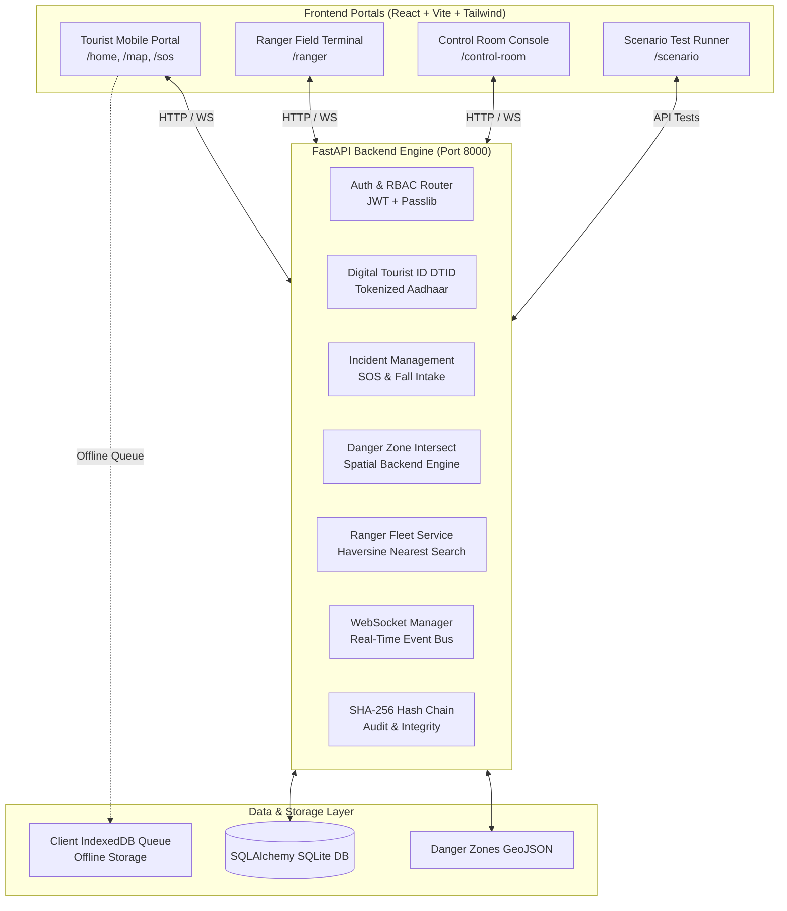

# 🌲 VanRakshak (वनरक्षक)
### Smart Wilderness Safety, Forest Survey & Emergency Response System
**Smart India Hackathon (SIH) | Problem Statement ID: SIH25002**

[](https://fastapi.tiangolo.com)
[](https://reactjs.org/)
[](https://vitejs.dev/)
[](https://tailwindcss.com/)
[](https://www.sqlalchemy.org/)
[](https://developer.mozilla.org/en-US/docs/Web/API/WebSockets_API)
[](LICENSE)

---

## 📌 Overview

**VanRakshak** is an expedition-grade wilderness safety and emergency management platform designed for high-risk, low-connectivity terrains (such as the Himalayas and North-East India). 

When connectivity is lost, standard safety apps fail. **VanRakshak** overcomes this with:
1. **Kinematic Dead-Reckoning Extrapolation**: Predicts tourist location along trail headings during zero-signal periods.
2. **Expanding Uncertainty Cone**: Dynamically calculates expanding search boundaries for Search and Rescue (SAR) units.
3. **Sensor-Fused Fall Detection**: In-browser accelerometer thresholding ($>0.85$ confidence) with automatic offline SOS queueing.
4. **Geofenced Hazard Intersections**: Real-time cross-referencing of tourist tracks against landslide, flood, and wildlife danger zones.
5. **Cryptographically Chained Audit Trails**: Immutable SHA-256 state tracking for every incident mutation.
6. **Tripartite Operational Topology**: Synchronous coordination between **Tourists**, **Field Rangers**, and the **Command & Control Room**.

---

## 🏗️ System Architecture



---

## 🚀 Key Features by User Role

### 🥾 1. Tourist Safety Portal (`/home`, `/map`, `/sos`)
- **Surveyed Trails Catalog**: Real-time trail health, distance, elevation gain, permit requirements (ILP/PAP), and hazard bypasses.
- **Live Safety Map**: Visualizes safe paths, ranger posts, shelter locations, and active danger zones.
- **Instant SOS & Fall Trigger**: Instant distress signal transmission with automated 30-second accelerometer fall countdown.
- **Digital Tourist ID (DTID)**: Tamper-proof QR token for fast park check-in and emergency medical profiling.
- **Offline Kinematics**: Tracks pre-loss walking speed and heading to maintain navigation continuity offline.

### 🛡️ 2. Forest Ranger Terminal (`/ranger`)
- **Live Dispatch Alerting**: Instant audio-visual alerts upon incident assignment with dynamic target coordinates.
- **Field Triage & Status**: Update incident status (`EN_ROUTE`, `ON_SCENE`, `RESOLVED`) with field triage notes.
- **Offline Route Caching**: Retains topographical maps and emergency shelters during zero-connectivity field patrols.

### 📡 3. Command & Control Room Console (`/control-room`)
- **Geospatial Common Operating Picture**: Real-time map displaying all registered hikers, field rangers, active threats, and incidents.
- **Automated Dispatch Engine**: Nearest-ranger calculation based on real-time GPS telemetry and estimated travel time (ETA).
- **Hazard Intersect Engine**: Auto-flags hikers whose routes intersect active landslides, flash floods, or wildlife sightings.
- **Emergency Broadcast Dispatch**: One-click broadcast of regional advisories and trail closures to all active mobile devices.

### 🧪 4. Scenario Runner & Integration Test Suite (`/scenario`)
Automated runner testing 8 real-world mission scenarios:
- `Scenario 01`: Direct Intake & SOS Dispatch
- `Scenario 02`: Signal Drop & Reconnection Recovery
- `Scenario 03`: Offline Sensor Fall Detection & Synced Queue
- `Scenario 04`: Multi-packet FIFO Offline Queue Drain
- `Scenario 05`: Control Room Unit Dispatch & Ranger Assignment
- `Scenario 06`: Aadhaar Hashing, DTID Generation & Hash-Chaining
- `Scenario 07`: Danger Zone LineString Route Intersection
- `Scenario 08`: Kinematic Dead-Reckoning Coordinate & Uncertainty Expansion

---

## 📐 Mathematical & Algorithmic Foundations

### 1. Great-Circle Distance (Haversine Formula)
$$\Delta\sigma = 2 \arcsin \left( \sqrt{\sin^2\left(\frac{\Delta\phi}{2}\right) + \cos(\phi_1)\cos(\phi_2)\sin^2\left(\frac{\Delta\lambda}{2}\right)} \right)$$
$$d = R_{\text{earth}} \cdot \Delta\sigma \quad (\text{where } R_{\text{earth}} = 6,371,000\text{ m})$$

### 2. Forward Azimuth (Travel Bearing)
$$\theta = \text{atan2}\left(\sin(\Delta\lambda)\cos(\phi_2), \; \cos(\phi_1)\sin(\phi_2) - \sin(\phi_1)\cos(\phi_2)\cos(\Delta\lambda)\right)$$

### 3. Dead-Reckoning Kinematics
$$d_{\text{offline}} = v_{\text{walk}} \times \Delta t_{\text{offline}}$$
$$\phi_{\text{estimated}} = \phi_0 + \frac{d_{\text{offline}} \cdot \cos(\theta)}{111,320}$$
$$\lambda_{\text{estimated}} = \lambda_0 + \frac{d_{\text{offline}} \cdot \sin(\theta)}{111,320 \cdot \cos(\phi_0)}$$

### 4. Dynamic Search Radius Expansion
$$R_{\text{search}} = R_{\text{base}} + \left(v_{\text{walk}} \times \Delta t_{\text{offline}} \times 1.15\right)$$

### 5. Cryptographic State Hash Chain
$$H_n = \text{SHA-256}\left( H_{n-1} \,\|\, \text{Timestamp} \,\|\, \text{Payload} \,\|\, \text{Author ID} \right)$$

---

## 🛠️ Quick Start & Installation

### Prerequisites
- **Node.js**: v18+ (Tested on v24)
- **Python**: v3.10+ (Tested on v3.12 & v3.13)
- **npm**: v9+

---

### Step 1: Start Backend Server

```bash
# Navigate to backend directory
cd backend

# Install dependencies
pip install -r requirements.txt

# Start FastAPI server
python -m uvicorn main:app --host 127.0.0.1 --port 8000 --reload
```
*Backend runs on: `http://127.0.0.1:8000`*  
*Interactive Swagger API docs: `http://127.0.0.1:8000/docs`*

---

### Step 2: Start Frontend Application

```bash
# Open a new terminal and navigate to frontend directory
cd frontend

# Install dependencies
npm install

# Start Vite dev server
npm run dev
```
*Frontend runs on: `http://localhost:5173`*

---

## 🔑 Pre-Seeded Test Credentials

| Role | Email | Password | Allowed Dashboards |
| :--- | :--- | :--- | :--- |
| **Control Room Admin** | `admin@vanrakshak.org` | `admin123` | `/control-room`, `/map`, `/home` |
| **Field Ranger** | `ranger@vanrakshak.org` | `ranger123` | `/ranger`, `/map`, `/home` |
| **Tourist** | `tourist@vanrakshak.org` | `tourist123` | `/home`, `/map`, `/sos` |

---

## 📁 Repository Structure

```
├── backend/
│   ├── main.py                     # FastAPI application entry & startup seed
│   ├── database.py                 # SQLite engine & session management
│   ├── config.py                   # App configuration & JWT settings
│   ├── requirements.txt            # Python dependencies
│   ├── middleware/
│   │   └── rbac.py                 # JWT extraction, auth middleware & role verification
│   ├── models/
│   │   ├── user.py                 # User & DTID identity models
│   │   ├── incident.py             # Incident tracking & state machine
│   │   ├── ranger.py               # Ranger units & GPS locations
│   │   ├── geofence.py             # Danger zone polygons & circles
│   │   ├── advisory.py             # Threat & weather warnings
│   │   └── network_coverage.py     # Signal propagation points
│   ├── routers/
│   │   ├── auth.py                 # Register, OTP verify, login
│   │   ├── identity.py             # Digital Tourist ID generation
│   │   ├── incidents.py            # Distress intake, dispatch & resolution
│   │   ├── danger_zones.py         # Geofencing & route intersection
│   │   ├── rangers.py              # Proximity search & ranger status
│   │   ├── weather.py              # Forecast & mountain weather feeds
│   │   └── advisories.py           # Public safety announcements
│   ├── services/
│   │   ├── hash_chain.py           # SHA-256 immutable audit chain
│   │   ├── spatial_backend.py      # Haversine & ray-casting algorithms
│   │   └── identity_service.py     # Aadhaar tokenization logic
│   └── websocket/
│       └── manager.py              # Multi-channel WebSocket broadcaster
│
├── frontend/
│   ├── package.json                # Frontend dependencies & scripts
│   ├── vite.config.js              # Vite configuration & dev proxy
│   ├── tailwind.config.js          # Expedition & Tiranga design tokens
│   └── src/
│       ├── App.jsx                 # Route definitions & RBAC guards
│       ├── index.css               # Global typography, colors & hairlines
│       ├── lib/
│       │   ├── api.js              # Axios instance with auth interceptors
│       │   ├── deadReckoning.js    # Kinematic speed & uncertainty engine
│       │   ├── trailsData.js       # Verified surveyed trail geodatabase
│       │   └── wsClient.js         # WebSocket auto-reconnect client
│       ├── store/
│       │   └── authStore.js        # Zustand auth state & session storage
│       └── pages/
│           ├── tourist/            # TouristHome, LiveSafetyMap, TouristSOS, Login, Register
│           ├── ranger/             # RangerTerminal
│           ├── control_room/       # ControlRoom
│           └── scenario/           # ScenarioRunner (8 integration test cases)
│
├── field_survey_protection_interface/
│   └── DESIGN.md                   # Full UI/UX Design System Specification
└── PROJECT_DOCUMENTATION.md        # Exhaustive Technical & Engineering Report
```

---

## 📄 License & Attribution

Developed under the **Smart India Hackathon (SIH)** framework for wilderness safety, disaster management, and public forest monitoring.  
Licensed under the **MIT License**.
